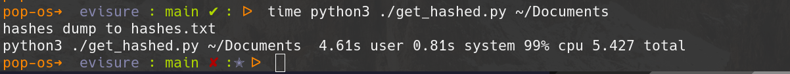
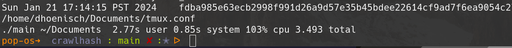

# Evidence Tool


## Crawlhash
This tool crawls a directory tree and outputs hashes to a json log file. The hash,
absolute file path, and datetime of the recording are save as a list of json objects.

### Instalation


Opt 1. **Pre-built bianaries**


Prebuilt bianaries are provided for easier set up. You can also build from source
if you would prefer.

_make the directory_
```bash
mkdir -p .local/bin/evitools/
```

_get the lastest version_
```bash
wget https://github.com/DavidHoenisch/crawlhash/releases/download/v0.0.8/crawlhash_0.0.8_linux_amd64.tar.gz
```

Note, in the above example you should replace the release and bianary to match your respective system. 
Bianaries are provided for all major systems and architectures.

_extract the bin from the archive_
```bash
tar xvf crawlhash_0.0.8_linux_amd64.tar.gz
```

_move into bin directory_
```bash
mv crawlhash ~/.local/bin/evitools/
```

_ensure that path is updated_
```bash
echo "export PATH=$PATH:$HOME/.local/bin/evitools/" >> .profile
```

note, depend on setup, path may need to be added to either the .bashrc file or
.zshrc profile. If after restarting shell you are not able to run the command 
`crawlhash`, rerun the above echo command but redirect to your shell profile (.bashr, .zshrc).


### Usage


#### crawlhash

Crawlhash takes in one filepath argument. This is the path to the root directory scan.
A singular file, `log.json` will be written to the directory the directory that crawlhash was 
run from. This file contains the output from crawlhash.

```bash
crawlhash ~/path/to/dir
```


### About

crawlhash is a port of a previous tool that I wroke that did the exact same thing.
That tool, found [here](https://github.com/DavidHoenisch/evisure) was tooled in 
python and was is significantly slower. 

As an example, I hashed my `~/Documents` folder which has about 13k files in it.

Here are screenshots from my testing:






Quite the signifcant speed improvement. This is not, however, a 1-to-1 comparison.
Both iterations of the tool writ the results to a file, but the golang implementation
records results to json. Writing results to json requires marginally more work. The golang
version is not only faster, it is faster while doing more.


### Improvements

I have a few items on the roadmap for improvement.

- [ ] Threading -> My thought is that each directory could be handed off to a seperate thread for hashing
- [ ] More command line options for flexibility implemented through use of the cobra library

